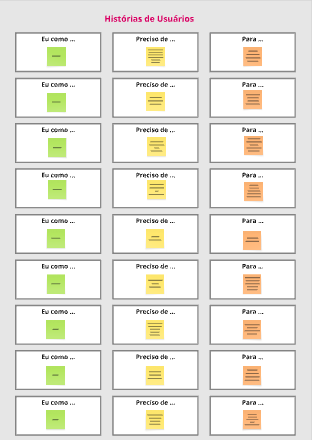
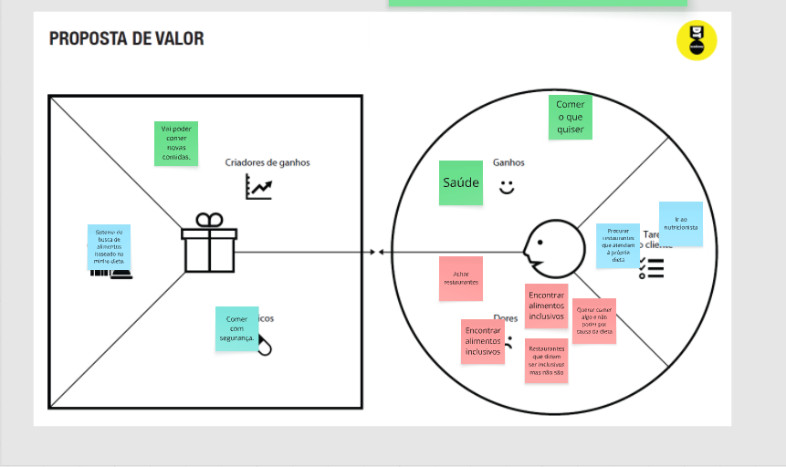
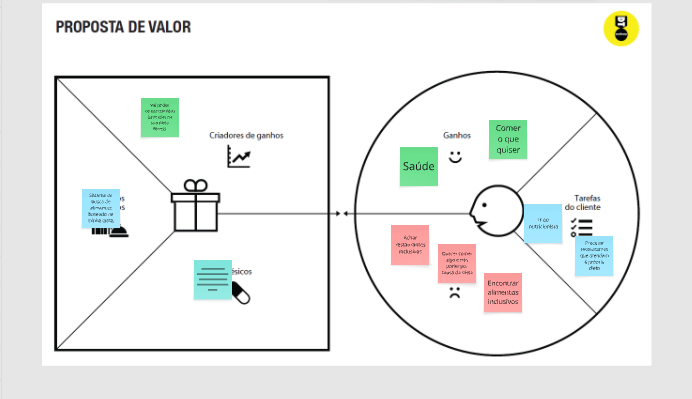
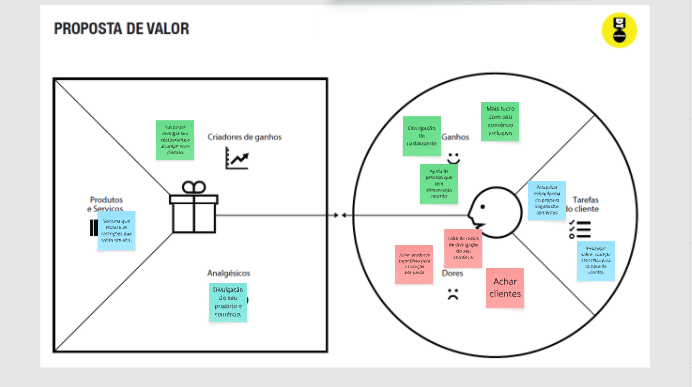

# Product Design

## Histórias de usuários

---

## Proposta de valor

O sistema conecta usuários com restrições alimentares a restaurantes seguros e transparentes.

### Valor para o usuário:

- Segurança alimentar
- Facilidade de busca
- Autonomia na escolha

### Valor para o restaurante:

- Maior visibilidade
- Público segmentado
- Diferenciação no mercado

---

## Requisitos funcionais

| ID | Descrição |
|----|----------|
| RF-001 | Cadastro de usuário |
| RF-002 | Login |
| RF-003 | Cadastro de restrições |
| RF-004 | Filtrar restaurantes |
| RF-005 | Exibir ingredientes |
| RF-006 | Buscar restaurantes |
| RF-007 | Editar perfil |

---

## Requisitos não funcionais

| ID | Descrição |
|----|----------|
| RNF-001 | Interface responsiva |
| RNF-002 | Resposta rápida (<3s) |
| RNF-003 | Interface intuitiva |
| RNF-004 | Segurança de dados |

---

## Restrições

| ID | Restrição |
|----|----------|
| 001 | Projeto acadêmico |
| 002 | Escopo limitado |
| 003 | Sem integração real obrigatória |