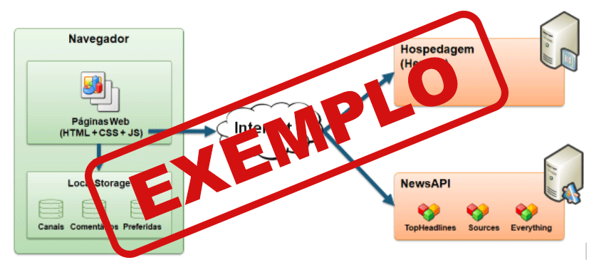

# Arquitetura da solução

<span style="color:red">Pré-requisitos: <a href="05-Projeto-interface.md"> Projeto de interface</a></span>

Definição de como o software é estruturado em termos dos componentes que fazem parte da solução e do ambiente de hospedagem da aplicação.



## Funcionalidades

Esta seção apresenta as funcionalidades da solução.

##### Funcionalidade 1 - Cadastro de restaurante

Permite a inclusão, leitura, alteração e exclusão de novos itens ao cardapio do restaurante para o sistema

* **Estrutura de dados:** 
* **Instruções de acesso:**
  * Abra o site e efetue o login como "admin";
  * Acesse o menu principal e escolha a opção "Cadastros";
  * Em seguida, escolha a opção "restaurantes".
* **Tela da funcionalidade**:


##### Funcionalidade 2 - Cadastro de pratos/cardapio
Permite a inclusão, leitura, alteração e exclusão de novos itens ao cardapio do restaurante para o sistema

 **Estrutura de dados:** 
* **Instruções de acesso:**
  * Abra o site e efetue o login como "admin";
  * Acesse o menu principal e escolha a opção "Cadastros";
  * Em seguida, escolha a opção "restaurante";


##### Funcionalidade 3 - sistema de mapa
permite localizar

* **Instruções de acesso:**
  * Abra o site e efetue o login com seu usuario;
  * Acesse o menu principal e escolha a opção "resuarantes";
  * Em seguida, escolha a opção "mapa";
  * **Tela da funcionalidade**:

  
  
##### Funcionalidade 4 - sistema para favoritar
permite fovoritar os resurantes favoritos

* **Instruções de acesso:**
  * Abra o site e efetue o login com seu usuario;
  * Acesse o perfil;
  * Em seguida, escolha a opção "favorito";
  * **Tela da funcionalidade**:

 
 ##### Funcionalidade 5 - sistema de pagamento
permite pagar os pratos pedidos

* **Instruções de acesso:**
  * Abra o site e efetue o login com seu usuario;
  * realize um pedido;
  * no carrinho clique "fanalizar pedido";
  * Em seguida, escolha a opção de pagamento favorita;
  * **Tela da funcionalidade**:

 

##### Estrutura de dados - Contatos

cadastro de restaurantes

```json
{
  "id": 1,
  "nome": "",
  "cnpj": "",
  "tipoCozinha": "",
  "cidade": "",
  "uf": "",
  "telefone": "",
  "restricoes": []
}
  
```
##### Estrutura de dados - pratos e cardapio

cadastro de pratos e cardapio
```json
{
  "id": 1,
  "nome": "",
  "restaurante": "",
  "descricao": "",
  "preco": 0.00,
  "alergenicos": "",
  "restricoes": []
}
```
##### Estrutura de dados - mapa
sistema de mapa
```json
{
  "id": 1,
  "nome": "",
  "categoria": "",
  "nota": 0,
  "distanciaKm": 0,
  "faixaPreco": "",
  "latitude": 0,
  "longitude": 0,
  "restricoes": []
}
```

##### Estrutura de dados - pagamento
```json
{
  "pagamento": {
    "idPedido": 1,
    "cliente": "",
    "prato": "",
    "quantidade": 1,
    "subtotal": 0.00,
    "taxaServico": 0.00,
    "total": 0.00,
    "metodo": "",
    "status": "Pendente",
    "pix": {
      "chave": "",
      "qrCode": ""
    }
  }
}
```


##### Estrutura de dados - Usuários  

Registro dos usuários do sistema utilizados para login e para o perfil do sistema.

```json
  {
    id: "eed55b91-45be-4f2c-81bc-7686135503f9",
    email: "admin@abc.com",
    id: "eed55b91-45be-4f2c-81bc-7686135503f9",
    login: "admin",
    nome: "Administrador do Sistema",
    senha: "123"
  }
```

> ⚠️ **APAGUE ESTA PARTE ANTES DE ENTREGAR SEU TRABALHO**
>
> Apresente as estruturas de dados utilizadas na solução tanto para dados utilizados na essência da aplicação, quanto outras estruturas que foram criadas para algum tipo de configuração.
>
> Nomeie a estrutura, coloque uma descrição sucinta e apresente um exemplo em formato JSON.
>
> **Orientações:**
>
> * [JSON Introduction](https://www.w3schools.com/js/js_json_intro.asp)
> * [Trabalhando com JSON - Aprendendo desenvolvimento web | MDN](https://developer.mozilla.org/pt-BR/docs/Learn/JavaScript/Objects/JSON)

### Módulos e APIs

Esta seção apresenta os módulos e APIs utilizados na solução.

**Images**:

* Unsplash - [https://unsplash.com/](https://unsplash.com/) ⚠️ EXEMPLO ⚠️

**Fonts:**

* Icons Font Face - [https://fontawesome.com/](https://fontawesome.com/) ⚠️ EXEMPLO ⚠️

**Scripts:**

* jQuery - [http://www.jquery.com/](http://www.jquery.com/) ⚠️ EXEMPLO ⚠️
* Bootstrap 4 - [http://getbootstrap.com/](http://getbootstrap.com/) ⚠️ EXEMPLO ⚠️


## Hospedagem

Explique como a hospedagem e o lançamento da plataforma foram realizados.

> **Links úteis**:
> - [Website com GitHub Pages](https://pages.github.com/)
> - [Programação colaborativa com Repl.it](https://repl.it/)
> - [Getting started with Heroku](https://devcenter.heroku.com/start)
> - [Publicando seu site no Heroku](http://pythonclub.com.br/publicando-seu-hello-world-no-heroku.html)

